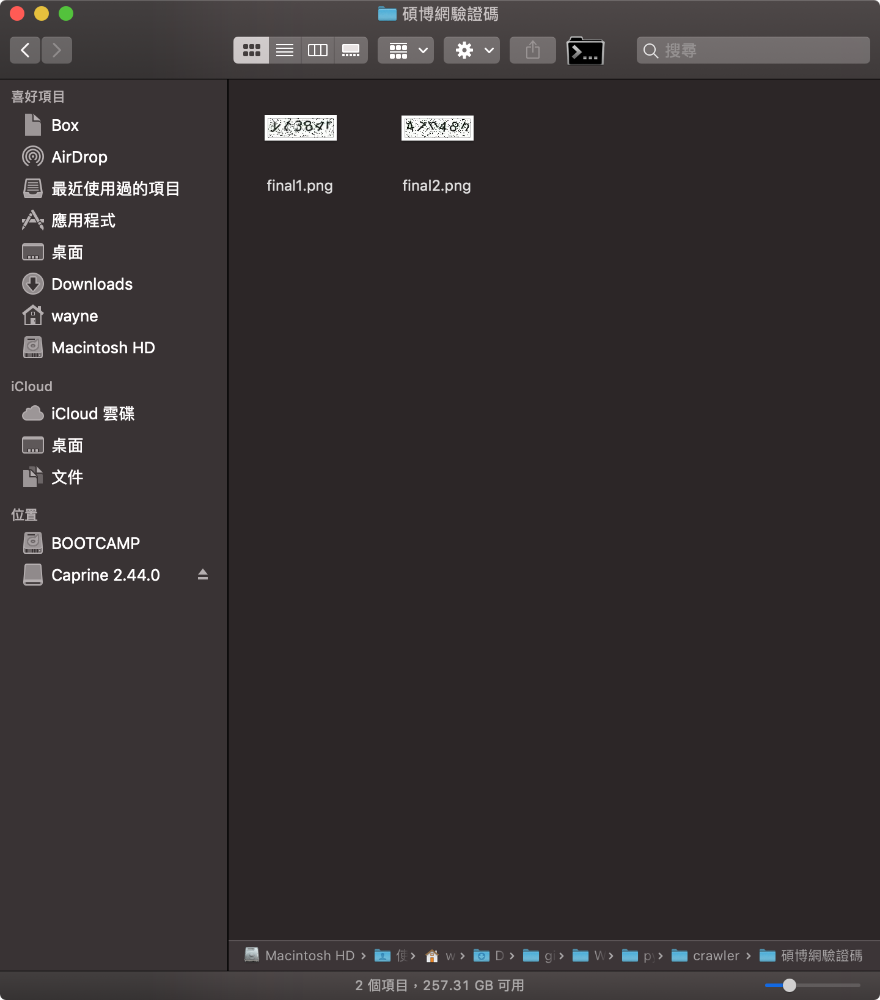
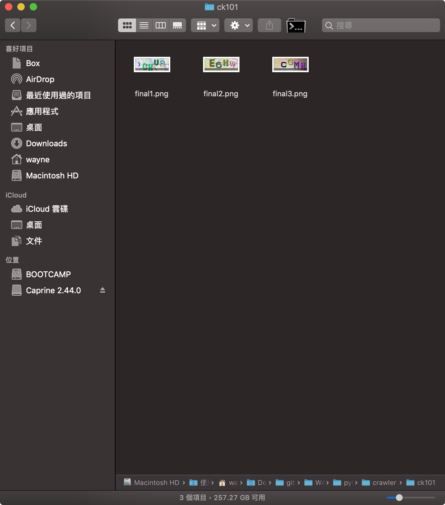
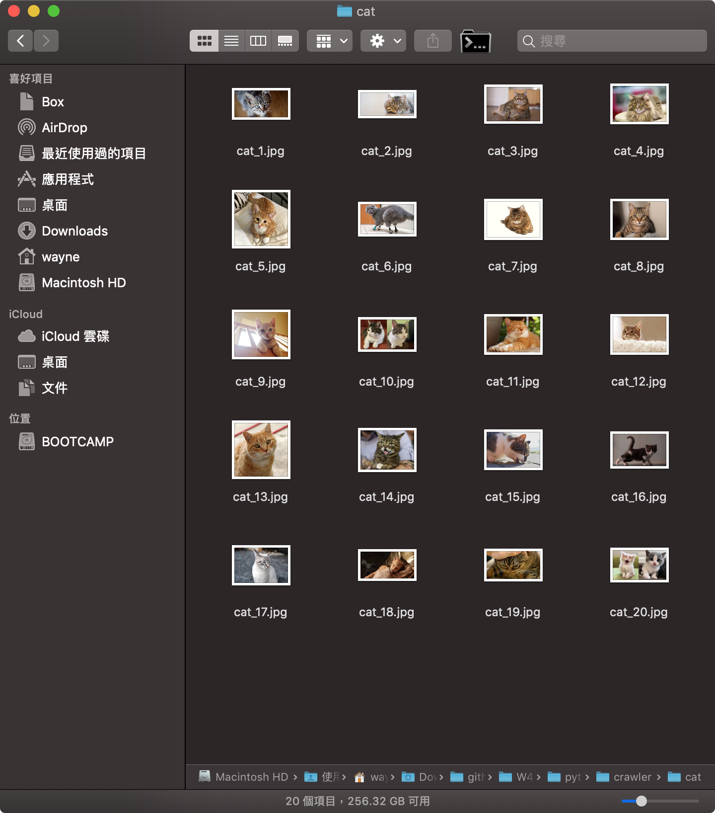

# Crawler

> 作者：W4YNELEE

### 事前安裝

```cmd
$pip install selenium
```

**若有chrome driver版本問題可由下方網址下載對應(最新版本):**

[ChromeDriver - WebDriver for Chrome](https://chromedriver.chromium.org/)

***

### 此資料夾內容物含以下兩種功能：

## 1.爬驗證碼
```
crawler.py
```

* 此程式針對`ck101.com`或` 碩博網`擷取認證碼，使用如程式結尾:

```python
#碩博網
mission = Ntltd_verify_code_crawler()
mission.get_the_code2(2) #input要爬的數量
```

```python
#ck101網
mission = Ck101_verify_code_crawler()
mission.get_the_code(3) #input要爬的數量
```

<br>


<br>

## 2.google爬圖
```
google_picture_crawler.ipynb
```

### 事前安裝
```cmd
$pip install selenium
$pip install opencv-python
$pip install bs4
$pip install matplotlib
```


* 此程式會針對要找的圖片建立路徑且從google爬圖存取
* 將關鍵字鍵入`keyword.txt`，預設是`cat`
* 用Jupiter notebook開啟`google_picture_crawler.ipynb`
* 修改`lim`可修改欲存圖片數量
* Cell->run all
* 底下用Matplotlib驗證



